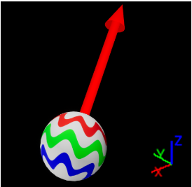
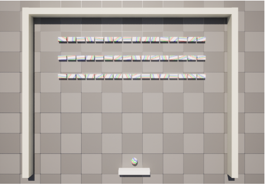

# Quantum Arkanoid

## Introduction

Welcome to a universe where quantum mechanics springs to life right before your eyes! Ever fancied manipulating quantum states yourself? If yes, then gear up for an exhilarating adventure with Quantum Arkanoid! Dive into a realm where the classic gameplay of Arkanoid melds seamlessly with the mind-bending quirks of quantum physics. Here, you will not only witness but also manipulate quantum states and magnetic forces, propelling you into a gameplay experience like no other. 

Prepare to embark on a journey filled with intriguing quantum phenomena—some familiar from the realms of quantum physics and quantum information science, and others utterly novel and thrilling. As you delve into this quantum-infused world, you will find that learning and fun go hand in hand. Your mission? Simple yet compelling: smash through barriers of bricks by skilfully bouncing the ball, all while aiming for that top score! Welcome to Quantum Arkanoid, where physics meets fun in a spectacular symphony of action!  

## System Requirements

- Operating System: Windows 10 or later 

- Storage: 1.5 GB of available space or more 

- Hardware: a mouse and a keyboard 

## Install Guide

Follow these steps to install Quantum Arkanoid on your computer: 

1. Download the game files from [here](https://drive.google.com/file/d/1zT3EM_Z-QN7sBUAOtlUgAKl6VsyAs88h/view?usp=drive_link). 
2. Unzip files to places you like. 
3. Double click QuantumArknoid.exe and just enjoy! 

## Controls

- Movement of paddle: WASD, Arrow keys or simply moving Mouse left and right are all supported 

- Launch the ball: Pressing Space Bar or Mouse Right Button to initiate the game 

- Quit: Just directly closing the window! 

## Gameplay Mechanics

### Quantum Features

- Quantum States: Bricks and the ball have unique quantum states represented visually. The ball's quantum state changes due to a magnetic field affecting its trajectory. 

- Visual Effects: Quantum states are visualized on the ball and bricks using dynamic textures and materials that illustrate the qubit's orientation on the Bloch sphere. 

  

### Power-Ups

- Paddle Length Increase: This power-up extends the paddle's length, making it easier to hit the ball. 

- Ball Speed: Increase the ball speed

  

## Navigating Game Levels

- Level 1: No magnetic field. Learn the basic mechanics. 

- Level 2: Magnetic field in effect. The ball’s trajectory changes dynamically. 

  

## FAQs

1. How do I advance to the next level? 

​         Please try to destroy all bricks in current level to progress. You can also switch the level by pressing 'H'.

2. Can I save my game progress? 

​          Currently, the game does not support progress saving. 

   3.How does my data get protected? 

​          We do not store or gather any personal data. Your privacy is protected. 